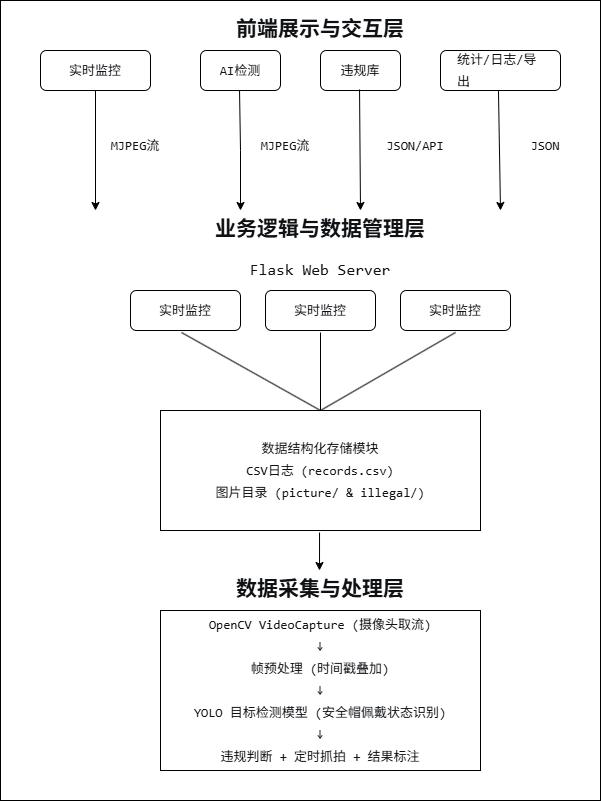

# 监控视频流的智能分析处理与关键信息提取系统
> 基于 YOLOv8 + OpenCV + Flask 的工地安全帽佩戴检测系统，实现视频流实时分析、违规抓拍与数据可视化

## ✨ 功能特性
- 🎥 **实时监控**：浏览器直接查看摄像头原始画面
- 🤖 **AI智能检测**：YOLO模型实时检测安全帽佩戴状态，红/绿框可视化标注
- 📸 **违规照片库**：自动抓拍违规画面，支持按日期筛选浏览
- 📊 **数据统计分析**：违规率/合规率统计、近7天趋势图、每日排行榜
- 📋 **系统日志**：完整的结构化检测记录，支持筛选查询
- 🚨 **今日告警**：当日违规事件汇总展示
- 📥 **数据导出**：支持导出 CSV / Excel 格式报表

## 🛠️ 技术栈

| 类别 | 技术 |
|------|------|
| 深度学习 | YOLOv8, Ultralytics |
| 计算机视觉 | OpenCV |
| Web后端 | Flask, Python |
| 数据存储 | CSV, 文件系统 |
| 前端 | HTML, CSS, JavaScript, Chart.js |
| 版本控制 | Git |

## 📐 系统架构




## 🚀 快速开始

### 环境要求
- Python 3.8+
- 摄像头（内置或外接）

### 安装步骤

```bash
# 1. 克隆项目
git clone https://github.com/zjqoyn/surveillance-video-intelligent-analysis.git
cd surveillance-video-intelligent-analysis

# 2. 创建虚拟环境（推荐）
python -m venv venv
source venv/bin/activate  # Windows: venv\Scripts\activate

# 3. 安装依赖
pip install -r requirements.txt

# 4. 下载模型文件
# 将 aqm.pt 放入 models/ 目录下

# 5. 启动服务
python app.py
